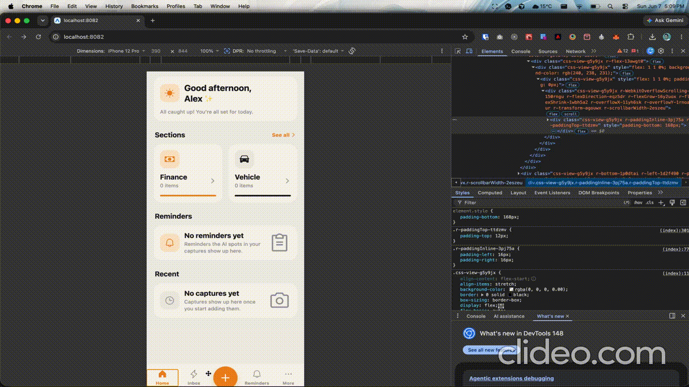

# Nudge AI

Sick of manually taking mulitple screenshots or describing to your llm this thing you want changed?
NudgeAI is menu-bar macOS app that helps you easily create a change list with screenshots all in one go to paste into your llm.

## Install

Download the latest signed + notarized `.dmg` from
[Releases](https://github.com/ddesilva/NudgeAI/releases), open it, and drag
**Nudge AI** to your Applications folder.

On first capture, macOS will ask for **Screen Recording** permission — grant it
under **System Settings ▸ Privacy & Security ▸ Screen Recording**, then quit and
reopen the app. Nudge AI is a **menu-bar app with no Dock icon** — look for the
viewfinder icon in the menu bar (top-right of the screen).

## Quick start

1. Press **⌘⇧N** (or click the viewfinder icon in the menu bar).
2. **Drag** a box around the region you want to change.
3. **Type** what you want changed in the panel that pops up.
4. Hit **⏎** to save and auto-rearm for the next region, or **⌘⏎** to save and
   finish the session.
5. When you're done, the **Review** window opens — reorder/edit/delete
   instructions, then click **Export & Copy Prompt**.
6. The session folder is written to `~/NudgeAISessions/Nudge-<timestamp>/` and a
   paste-ready prompt is on your clipboard. Paste it into Claude Code / Codex
   and they'll read the screenshots straight from disk.

## Keyboard shortcuts

### Global

| Shortcut | Action |
|---|---|
| **⌘⇧N** | Start (or end) a Nudge session. Configurable in Settings; can be disabled. |

### While a session is open

| Shortcut | Action | Where |
|---|---|---|
| **drag** | Select a region | Selection overlay |
| **esc** | Cancel the current selection / instruction; end the session if nothing is captured | Selection overlay, instruction panel |
| **⏎** | Save the instruction and auto-rearm for the next region | Instruction panel |
| **⌘⏎** | Save the instruction and finish the session (skipping Review if there's only one box) | Instruction panel |
| **shift+⏎** | Insert a newline in the instruction | Instruction panel |
| **click ×** | Cancel this instruction and go back to selection | Instruction panel |

## Settings

Open via the menu bar ▸ **Settings…** (or **⌘,**).

- **Global hotkey** — change which key combination starts a session, or disable
  it entirely. Click the shortcut button, then press your desired combination
  (must include ⌘, ⇧, ⌥, or ⌃).
- **Keep saved sessions for** — auto-purge session folders older than N days
  (1–365, default 7). The purge runs at launch, every 6 hours, and whenever
  you change the setting.
- **Save sessions to** — pick a custom folder for new session captures. Defaults
  to `~/NudgeAISessions`. Existing sessions in the previous location stay where
  they are; only new sessions write to the new path. **Reveal in Finder** and
  **Reset** buttons let you jump to it or revert to the default.

## What a session produces

A timestamped folder under your configured storage location (default
`~/NudgeAISessions/`), e.g. `Nudge-20260605-114523/`:

- `shot-01.png`, `shot-02.png`, … — the captured regions (Retina-resolution)
- `instructions.md` — each screenshot paired with its instruction
- `nudge.json` — machine-readable manifest (files, instructions, pixel sizes)
- `prompt.txt` — the paste-ready prompt that gets copied to your clipboard

On export, the prompt (referencing absolute image paths) is copied to your
clipboard — ideal for terminal agents like Claude Code / Codex, which read the
image files from disk.

### Why not "everything on the clipboard"?

macOS can't reliably paste N images + matching text in one go: terminals can't
accept pasted images at all, and chat apps take only one image per paste. So the
session **folder** is the real artifact — point your agent at it (or paste the
copied prompt). The Review window is your visual preview before exporting.

## Browsing past sessions

Menu bar ▸ **Browse Sessions…** (or **⌘B**) opens a library window with every
session under your storage folder, newest first. Click a session to see its
captures and instructions, or re-export and re-copy its prompt without
re-capturing anything.

